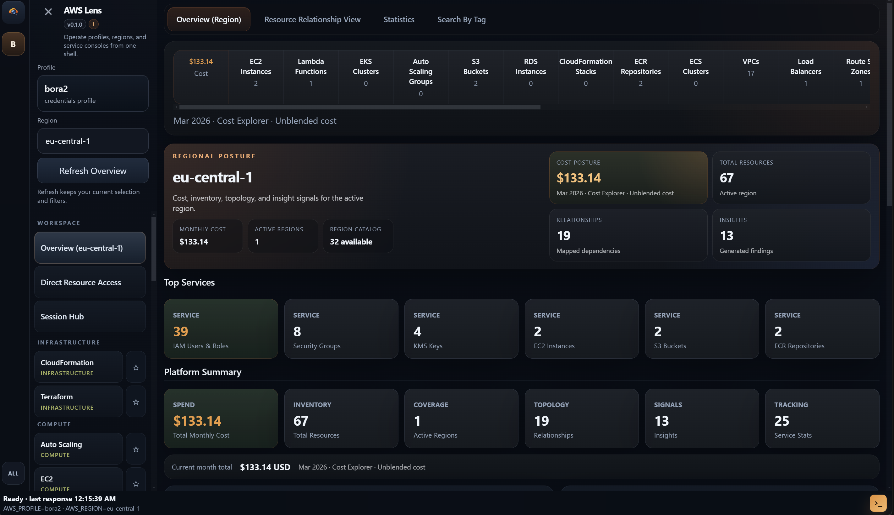

# Cloud Lens

Cloud Lens is a desktop app for people who spend too much of the day jumping between a cloud console, Terraform, and a terminal.

That is the whole idea. Keep the working context in one place so you can inspect something, figure out whether Terraform owns it, run the next command, and move on without rebuilding the same mental state three times.

The repo still carries some legacy `aws-lens` naming in package metadata and local storage. That is intentional for now. The product name is `Cloud Lens`.



## Current state

Right now the app is in an uneven but usable place:

- AWS is the main experience.
- GCP is in beta.
- Azure is not active yet and is still being built.

If you open the codebase, you will see Azure scaffolding and some GCP plumbing beyond that label. That does not change the product status. AWS is the part you can lean on today. GCP is there if you want to try it. Azure is not ready.

## Why this exists

Cloud work gets scattered fast.

You open a provider console to inspect a resource. Then you switch to Terraform to see whether the thing is managed. Then you open a shell because the next step is a command, not a button. Somewhere in the middle you also switch account, role, region, project, or location and lose your place.

Cloud Lens tries to cut down that churn. It is not trying to replace AWS, GCP, or Terraform. It is trying to make the handoff between them less annoying.

## What is in the app

There are a few shared workspaces that sit above any single provider:

- `Overview`
- `Terraform`
- `Session Hub`
- `Compare`
- `Compliance Center`

On top of that, the app has provider-specific workspaces.

### AWS

AWS is the most complete provider surface in Cloud Lens right now.

Current AWS workspaces include:

- EC2
- CloudWatch
- CloudTrail
- S3
- Lambda
- Auto Scaling
- RDS
- CloudFormation
- ECR
- EKS
- ECS
- VPC
- Load Balancers
- Route 53
- Security Groups
- ACM
- IAM
- Identity Center / SSO
- SNS
- SQS
- STS
- KMS
- WAF
- Secrets Manager
- Key Pairs

This is also where most of the session, terminal, drift, adoption, and day-to-day operator flows are wired up.

### GCP beta

GCP has landed as a beta surface. It is not just a placeholder anymore, but I still would not describe it as finished.

Current GCP workspaces include:

- Projects
- IAM Posture
- Compute Engine
- GKE
- Cloud Storage
- Cloud SQL
- Logging
- Billing Basics

These screens already plug into the shared navigation and terminal model, which matters more than it sounds. The point is that GCP is starting to feel like part of the same app instead of a disconnected experiment.

### Azure

Azure is not active in the current product.

There is early provider scaffolding in the repo, but the Azure side is still under construction. For now, treat Azure as planned work rather than something you can rely on in the UI.

## What you can actually do with it

### Keep Terraform close to live infrastructure

Terraform is built into the app instead of being treated like a separate mode you mentally switch into.

You can track projects, inspect plans, review drift, browse state, and keep command history near the resources those projects affect.

There is also Terraform adoption work for unmanaged resources. In the better-supported paths, the app can walk you toward generated HCL and import guidance. In the rougher paths, it falls back to a manual adoption preview.

### Move from inspection to action without losing context

There is an embedded terminal, and it follows the active context. That means you can inspect something in the UI and then run the next command without redoing the same setup by hand.

### Work with sessions and roles without the usual friction

Session Hub is there for the usual AWS account and assume-role mess. Save targets, activate a session, keep using that context, and stop rebuilding short-lived credentials from scratch.

### Compare environments

When something looks wrong in one account, region, or project, Compare gives you a way to inspect differences side by side instead of flipping between tabs and hoping you remember what changed.

### Store local secrets the app needs

Cloud Lens has a local encrypted vault for app-managed credentials and other sensitive local material.

That includes things like:

- database logins
- API tokens
- kubeconfig fragments
- PEM files
- SSH private keys

The app also has helper flows and presets around EC2 SSH, EKS kubeconfig work, and RDS connection handling.

## Getting started

```powershell
pnpm install
pnpm dev
```

For packaged builds:

```powershell
pnpm dist
pnpm dist:win
pnpm dist:mac
pnpm dist:linux
```

## Requirements

- Node.js 20 or newer
- `pnpm`
- local AWS credentials if you want AWS workflows
- Terraform CLI if you want Terraform features

Optional but useful:

- `gcloud` for GCP beta workflows
- AWS CLI
- `kubectl`
- `docker`
- `tflint`, `tfsec`, `checkov`

## Technical notes

This is an Electron app with:

- `src/main/` for privileged logic, provider integrations, Terraform orchestration, and IPC
- `src/preload/` for the secure renderer bridge
- `src/renderer/` for the React UI
- `src/shared/` for shared types and contracts

The naming is still mid-migration:

- product brand: `Cloud Lens`
- package name: `aws-lens`
- legacy local namespace: `aws-lens`

That split is there so older local state does not break during the rename.

The app reads local workstation context when it needs to, including:

- `~/.aws/config`
- `~/.aws/credentials`
- local Terraform project folders
- local `gcloud` / ADC context for GCP flows

It also stores app state under Electron `userData`, including files such as:

- `local-vault.json`
- `phase1-foundations.json`
- `compare-baselines.json`
- `terraform-workspace-state.json`
- `session-hub.json`
- `profile-registry.json`
- `terraform-state-backups/`

Important behavior:

- app-managed credentials stay in the encrypted local vault instead of being written back to provider credential files
- temporary assumed-role credentials stay in memory
- mutating actions run through the Electron main process
- the renderer talks to that layer through the preload bridge

## More docs

The `docs/` directory has the implementation and workflow notes:

- [AWS usage and security](docs/aws-lens-usage.md)
- [Session Hub](docs/session-hub-usage.md)
- [Terraform workspace management](docs/terraform-workspace-management.md)
- [Terraform drift reconciliation](docs/terraform-drift-reconciliation.md)
- [Terraform state operations center](docs/terraform-state-operations-center.md)
- [Observability and resilience lab](docs/observability-and-resilience-lab.md)

Some of those files still use the old `aws-lens` naming. That is just rename lag.

## Contributing

Start with [CONTRIBUTING.md](CONTRIBUTING.md).

## License

MIT. See [LICENSE](LICENSE).
